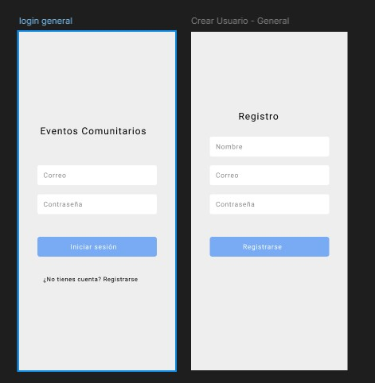
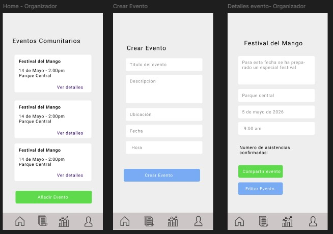
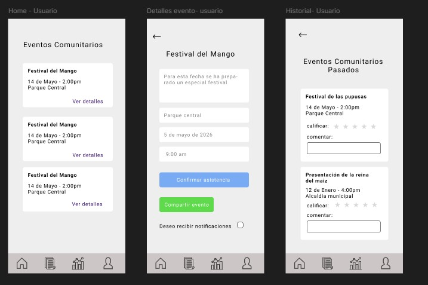
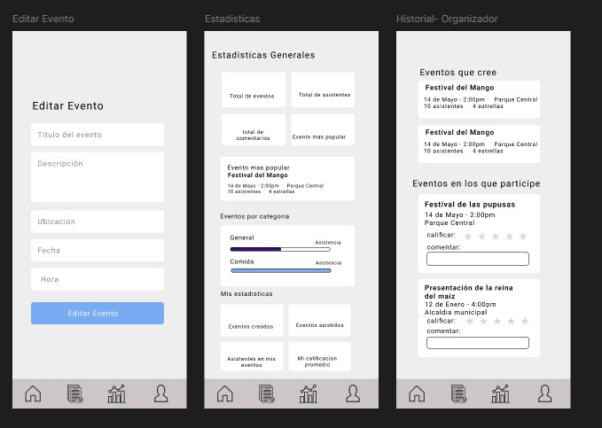

[](https://creativecommons.org/licenses/by-nc/4.0/)


# Aplicación de Gestión de Eventos Comunitarios
Aplicación móvil desarrollada con React Native + Expo para gestionar eventos comunitarios, permitiendo crear, explorar y administrar eventos locales.


## Integrantes
Katherine Estefany Beltrán López 			BL233081 
José Rodolfo Herrera Tario 				HT202962 
José David Carabantes Hernández 			CH252330 


## Tecnologías utilizadas
- React Native
- Expo
- Firebase Authentication
- Firebase Firestore
- React Navigation
- AsyncStorage
- Axios


- ## Mockups UX/UI
Diseños realizados en Figma: 
[Ver Mockups] https://www.figma.com/design/dqkeniPm0SDR7KQsZE4HKs/Proyecto-Final?node-id=0-1&t=TGhxsIh2UT0zir87-1


## Funcionalidades

✔ Registro e inicio de sesión
✔ Verificación por correo
✔ Creación de eventos
✔ Historial de eventos
✔ Estadísticas
✔ Cierre de sesión
✔ Navegación entre pantallas


## Instalación

Clonar proyecto:
```bash
git clone URL_REPOSITORIO
```
Entrar:
```bash
cd eventos-app
```
Instalar:
```bash
npm install
```
Ejecutar:
```bash
npx expo start
```
## Configuración Firebase
Crear:
```text
src/firebase/config.js
```
Agregar configuración personal de Firebase.


## Licencia

Este proyecto utiliza:
Creative Commons Attribution-NonCommercial 4.0 International (CC BY-NC 4.0)

Más información:
https://creativecommons.org/licenses/by-nc/4.0/


## Documentación

Manual de usuario y documentación:
https://udbedu-my.sharepoint.com/:w:/r/personal/bl233081_alumno_udb_edu_sv/_layouts/15/Doc.aspx?sourcedoc=%7B7dc5a59a-9a62-4bcf-8866-2d07d1472ef7%7D&action=default

## Mockups UX/UI

Diseños realizados en Figma para mostrar la propuesta visual de la aplicación.

### Login y Registro


### Home Organizador / Crear Evento / Detalles Evento Organizador


### Home Usuario / Detalles Evento / Historial Usuario


### Editar Evento / Estadísticas / Historial Organizador


